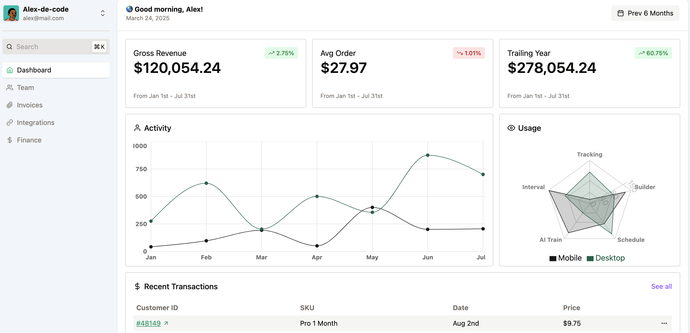

# Admin Dashboard

A modern admin dashboard built to showcase frontend development skills using cutting-edge technologies.



[Live Site](https://dashboard-admin-1.netlify.app/)

## Features

- Responsive layout with Tailwind CSS
- Interactive data visualizations using Recharts
- Command menu accessible through cmd + K
- Performance optimized with Vite
- Mock API integration
- Modular component architecture

## Technologies Used

- ⚡ [Vite](https://vitejs.dev/) - Next generation frontend tooling
- 🎨 [Tailwind CSS](https://tailwindcss.com/) - Utility-first CSS framework
- 📊 [Recharts](https://recharts.org/) - Composible charting library
- ⌨️ [cmdk](https://github.com/pacocoursey/cmdk) - Fast, unstyled command menu
- 🔄 [React Icons](https://react-icons.github.io/react-icons/) - Popular icons library

## Installation

1. Clone the repository

   ```bash
   git clone https://github.com/Alex-de-code/admin-dashboard-1.git
   ```

2. Navigate to the project directory

   ```bash
   cd admin-dashboard
   ```

3. Install dependencies

   ```
   npm install
   ```

4. Start the development server

   ```
   npm run dev
   ```
